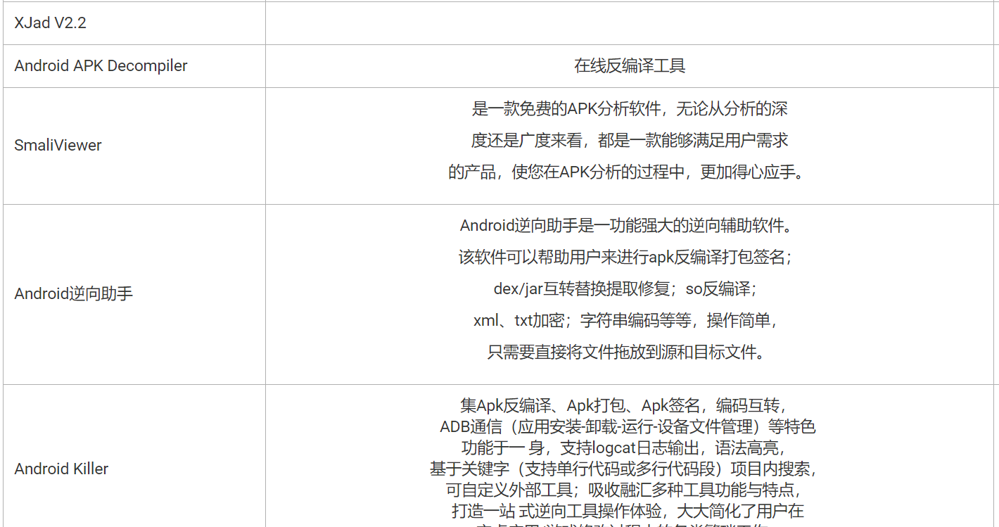

## android反编译与学习别人的代码

### 一、常用反编译工具

AndroidDevTools:[http://www.androiddevtools.cn/](http://www.androiddevtools.cn/)

### 二、AndroidKiller反编译今日头条

这里已AndroidKiller为例反编译今日头条最新版本，目前最新版本为1.3.1。

双击AndroidKiller.exe打开，将需要反编译的apk拖拽到AndroidKiller面板中,AK会自动反编译，在我的电脑反编译不到2分钟完成。

在AndroidKiller\projects目录下可以看到反编译后的文件,classes-dex2jar.jar为反编译后源码

### 三、jd-gui查看源码

打开AndroidKiller\bin\jd-gui目录中的jd-gui.exe，将classes-dex2jar.jar

### 四、分析今日头条使用的框架

从jd-jui中，打开今日头条个个包，能够发现它使用的各种框架：

1.okhttp3:[https://github.com/square/okhttp](https://github.com/square/okhttp)

2.retrofit：[https://github.com/square/retrofit](https://github.com/square/retrofit)

3.picasso：图片下载缓存框架，和UIL类似[https://github.com/square/picasso/](https://github.com/square/picasso/)

4.Android-PullToRefresh:下拉刷新[https://github.com/chrisbanes/Android-PullToRefresh/](https://github.com/chrisbanes/Android-PullToRefresh/)

5.ijkmediaplayer：[https://github.com/Bilibili/ijkplayer](https://github.com/Bilibili/ijkplayer)

6.droidsonroids：一个显示gif动图的框架[https://github.com/koral--/android-gif-drawable](https://github.com/koral--/android-gif-drawable)

7.gson:[https://mvnrepository.com/artifact/com.google.code.gson/gson](https://mvnrepository.com/artifact/com.google.code.gson/gson)

8.其他：头条还是用了umeng统计、微信等第三方sdk。